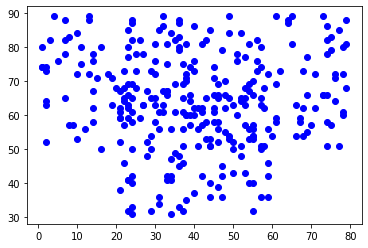

# K-means clustering practical

## 1.Write a clustering problem generator with signature:


```python
def scatter_clusters(
  centers: list,
  spread: list,
  n_points: int
) -> list:
    scattering = []
    for point in range(n_points):
        point_center = choice(centers)
        point_dist_x = choice(spread)
        point_dist_y = choice(spread)
        x = point_center[0] + point_dist_x
        y = point_center[1] + point_dist_y
        point_coord = (x,y)
        scattering.append(point_coord)
    return scattering
```


```python
test_easy_scattering = [scatter_clusters(centers = [(1,50)], spread = list(range(15)), n_points = 50), 
                        scatter_clusters(centers = [(20,30)], spread = list(range(15)), n_points = 50),
                        scatter_clusters(centers = [(40,50)], spread = list(range(15)), n_points = 50)]
```


```python
test_hard_scattering = [scatter_clusters(centers = [(1,50)], spread = list(range(40)), n_points = 100),
                        scatter_clusters(centers = [(20,30)], spread = list(range(40)), n_points = 100),
                        scatter_clusters(centers = [(40,50)], spread = list(range(40)), n_points = 100)]
```


```python
easy_scattering = []
for x in test_easy_scattering:
    for i in x:
        easy_scattering.append(i)  
        
hard_scattering = []
for x in test_hard_scattering:
    for i in x:
        hard_scattering.append(i)          
    
```


```python
for i in range(len(test_easy_scattering)):
    for x, y in test_easy_scattering[i]:
        plt.scatter(x,y, c = 'blue')
plt.show()
```


    

    


```python
for i in range(len(test_hard_scattering)):
    for x, y in test_hard_scattering[i]:
        plt.scatter(x,y, c = 'blue')
plt.show()
```


    

    


## 2.Implement K-means clustering as shown in Daumé


```python
def kmeans_cluster_assignment(
  k: int,
  points: list,
  centers_guess: Optional[list] = None,
  max_iterations: Optional[int] = None,
  tolerance: Optional[float] = None
) -> list:
    
    
    cl_centres = {}
    
    if centers_guess == None:
        for k in range(k):
            cl_centre = (randint(1, 50), randint(40,100))
            cl_centres[cl_centre] = []
    else:
        for center in centers_guess:
            cl_centres[center] = []
    
    if not max_iterations:
        max_iterations = 10
    else: 
        pass
    while max_iterations > 0:
        
        old = []
        for k in cl_centres.keys():
            old.append(k)
        
        for key,v in cl_centres.items():
            if v:
                cl_centres[key] = (np.mean([ i[0] for i in v]), np.mean([ i[1] for i in v]))
            else:
                cl_centres[key] = (randint(1, 50), randint(40,100))
        
        new = []
        cl_centres  = dict([(value, key) for key, value in cl_centres.items()])
        for key in cl_centres.keys():
            new.append(k)
            cl_centres[key] = []
            
        for point in points:
            point_to_center_dist = [(center, math.dist(center, point)) for k, center in enumerate(cl_centres)]
            point_center = min(point_to_center_dist, key = lambda x: x[1])[0]
            cl_centres[point_center].append(point)
            
        tl = np.linalg.norm(np.array(new)-np.array(old))
        max_iterations -= 1
        
        if tolerance == None:
            continue
            
            
        else:
            if tl <= tolerance:
                break
            else:
                max_iterations -= 1
                continue
                
                
    return cl_centres
```


```python
def plot(data):
    i = -1
    colors = ['blue', 'lightblue', 'lightgreen']
    for cluster in [data[x] for x in data]:
        i += 1
        for x,y in cluster:
            plt.scatter(x,y, c = colors[i])
        
    for centre in data:
        for x,y in data:
            plt.scatter(x,y, c = 'red')
    return plt.show()
```

### For the easy problem there's no visible difference in assignment between random initialisation, 25%, 50%, 75%, 100% of iterations


```python
easy_problem = kmeans_cluster_assignment(k = 3, points = easy_scattering)
plot(easy_problem)
```


    

    


### For the hard problem there're changes on every stage of iterations but with indicated "tolerance" parameter(tolerance = 0.001) the assignment stabelizes at 75% of iterations.


```python
hard_problem = kmeans_cluster_assignment(k = 3, points = hard_scattering)
plot(hard_problem)
hard_problem1 = kmeans_cluster_assignment(k = 3, points = hard_scattering, max_iterations = 25)
plot(hard_problem1)
hard_problem2 = kmeans_cluster_assignment(k = 3, points = hard_scattering, max_iterations = 50)
plot(hard_problem2)
hard_problem3 = kmeans_cluster_assignment(k = 3, points = hard_scattering, max_iterations = 75)
plot(hard_problem3)
hard_problem4 = kmeans_cluster_assignment(k = 3, points = hard_scattering, max_iterations = 100)
plot(hard_problem4)
```


    

    


    

    


    

    


    

    


    

    


## 3.Study the performance of these two implementations: memory, speed, quality; compare against scipy.cluster.vq.kmeans.

#### To compute memory and speed of algorithms I used %memit and %time respectively. 
#### For the easy problem:
#### scipy_kmeans: 
#### Wall time: 260 ms
#### peak memory: 101.62 MiB, increment: 1.73 MiB

#### my script:
#### Wall time: 504 ms
#### peak memory: 122.80 MiB, increment: 0.01 MiB


    


```python
%load_ext memory_profiler
```

    The memory_profiler extension is already loaded. To reload it, use:
      %reload_ext memory_profiler
    


```python
%time scipy_kmeans(easy_scattering)
```


    

    


    Wall time: 260 ms
    


```python
%memit scipy_kmeans(easy_scattering)
```


    

    


    

    


    peak memory: 101.62 MiB, increment: 1.73 MiB
    


```python
%%time
easy_problem = kmeans_cluster_assignment(k = 3, points = easy_scattering)
easy_plot(easy_problem)
```

    Wall time: 421 ms
    


    

    


```python
%%memit
easy_problem = kmeans_cluster_assignment(k = 3, points = easy_scattering)
easy_plot(easy_problem)
```

    peak memory: 122.80 MiB, increment: 0.00 MiB
    


    

    


## Compute the performance of your algorithm as percent of points assigned the correct cluster. (Your algorithm may order the clusters differently!) Graph this as a function of iterations, at 10% intervals.


```python
hard_problem = kmeans_cluster_assignment(k = 3, points = hard_scattering, max_iterations = 100, tolerance = 0.0001)

```


```python
test_data = [cl for cl in test_hard_scattering]
```


```python
data = [hard_problem[x] for x in hard_problem]
```


```python
def data_sorter(data):
    data_s = [] 
    for x in data:
        data_s.append(sorted(x))
    return sorted(data_s)
```


```python
def scorer(test_data, data, scattering):
    t_data = data_sorter(test_data)
    v_data = data_sorter(data)
    data_length = len(scattering)
    correct = 0
    for x in range(len(v_data)):
        for i in range(len(v_data[x])):
            if np.all(v_data[x][i] in t_data[x]):
                correct += 1
    return correct/data_length
```


```python
scorer = scorer(test_data, data, hard_scattering)
```


```python
performance = []
for i in range(10, 101, 10):
    performance.append(scorer)
```


```python
_ = plt.plot(performance, marker='o')
_ = plt.yticks(np.arange(0, 1.1, step=0.1))
_ = plt.xticks([i for i in range(0, 10)], [i for i in range(10, 101, 10)])
plt.show()
```


    

    


```python

```
